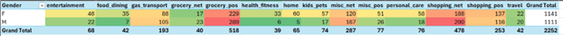
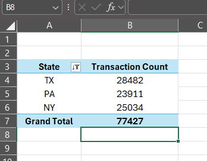
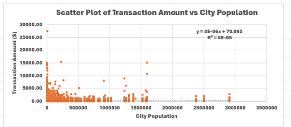
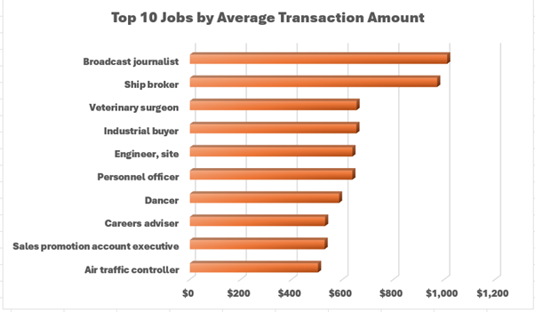
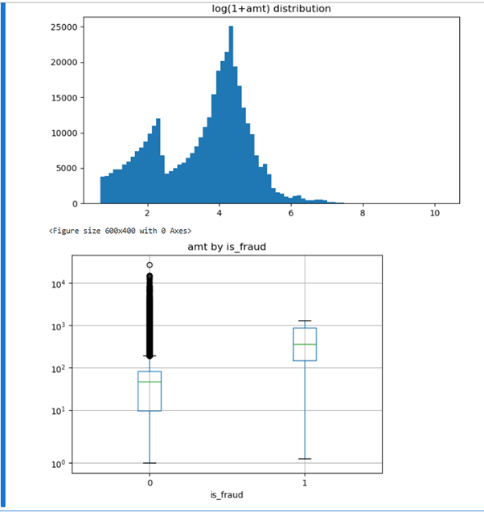
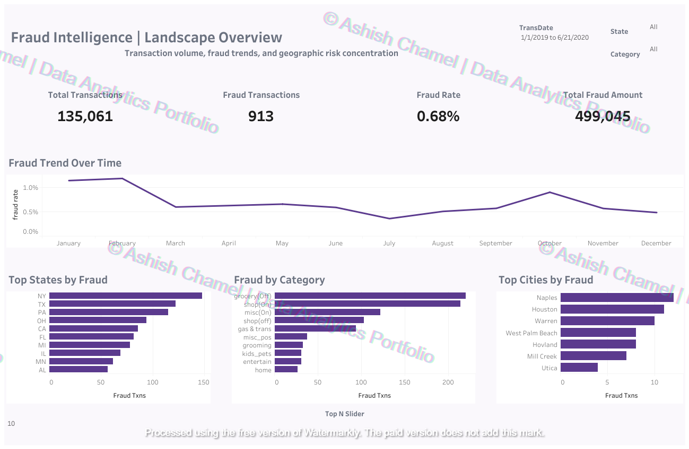
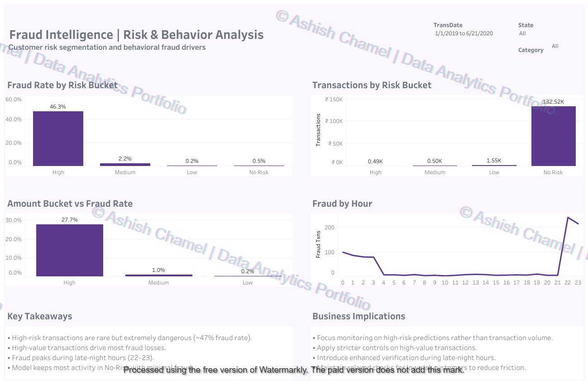
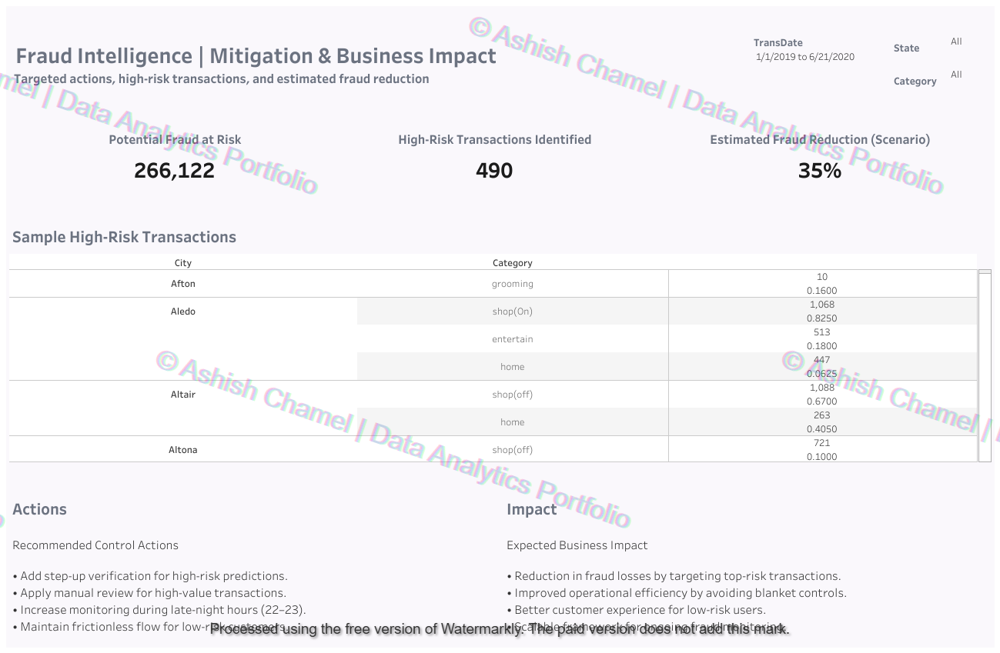

Financial Fraud Detection Capstone Project

This project presents an end-to-end financial fraud detection workflow using Excel, SQL, Python, and Tableau.

The objective is to analyze transaction data, identify fraud patterns, engineer predictive features, and translate analytical findings into business-ready fraud intelligence dashboards.

Objective

To detect, analyze, and visualize fraudulent credit card transactions through a multi-tool analytics workflow:

Validate and explore data using Excel

Derive fraud metrics using SQL

Perform statistical and visual EDA in Python

Design executive-level Tableau dashboards for fraud monitoring and mitigation

Project Workflow
Step 1 — Excel: Data Validation & Preliminary Analysis

(Reference: Report Step 1D–1H)

The dataset was initially explored in Excel to understand transaction distributions, detect anomalies, and validate data quality.

<p align="center"> <br> <em>Histogram of transaction amounts</em> </p> <p align="center"> <br> <em>Fraud distribution by gender and product category</em> </p> <p align="center"> <br> <em>Top 3 states by transaction volume</em> </p> <p align="center"> <br> <em>Correlation between transaction amount and city population</em> </p> <p align="center"> <br> <em>Average transaction amount by job category</em> </p>

These steps ensured structural consistency before deeper analysis.

Step 2 — SQL: Fraud Summary & Aggregations

(Reference: Report Step 2)

SQL queries executed in MySQL Workbench were used to:

Compute total transactions and fraud cases

Calculate overall fraud rate

Aggregate transaction volume by category and geography

Validate dataset consistency

<p align="center"> <br> <em>SQL fraud summary showing total transactions, fraud count, and fraud percentage</em> </p>
Step 3 — Python: Exploratory Data Analysis (EDA)

(Reference: Report Step 3D–3N)

EDA was performed using Pandas, Matplotlib, and Seaborn to explore transaction behavior and fraud characteristics.

<p align="center"> <br> <em>Boxplot of transaction amount vs fraud label</em> </p>

Key findings:

Fraudulent transactions are concentrated around higher transaction amounts

Genuine transactions display lower variance compared to fraudulent ones

Fraud shows temporal clustering patterns

Step 4 — Feature Engineering & Model Insights

(Reference: Report Step 3N)

Feature importance analysis was conducted to identify variables influencing fraud probability.

<p align="center"> <br> <em>Feature importance visualization highlighting top fraud predictors</em> </p>

Insights:

Transaction amount (amt) and derived log-transformed features are strong indicators

Behavioral features such as job and category contribute secondary predictive power

Step 5 — Tableau: Fraud Intelligence Dashboards

Final insights were translated into three business-oriented dashboards focused on monitoring, behavioral analysis, and mitigation strategy.

Fraud Intelligence | Landscape Overview

High-level monitoring dashboard summarizing volume, fraud rate, trends, and geographic concentration.

<p align="center">  </p>
Fraud Intelligence | Risk & Behavior Analysis

Risk segmentation and behavioral fraud drivers.

<p align="center">  </p>


Key insights:

High-risk transactions are rare but show extremely high fraud rates

Fraud peaks during late-night hours (22–23)

High-value transactions drive disproportionate fraud losses

Fraud Intelligence | Mitigation & Business Impact

Operational actions and estimated fraud reduction scenarios.

<p align="center">  </p>

Business implications:

Prioritize monitoring of high-risk transactions

Apply stricter controls on high-value payments

Introduce enhanced verification during late-night hours

Maintain low friction for low-risk customers

Tools & Technologies
Tool	Purpose
Excel	Data validation and pivot analysis
MySQL Workbench	Aggregation and fraud metrics
Python (Pandas, Matplotlib, Seaborn)	EDA and feature analysis
Tableau Desktop	Executive dashboards and visualization

Repository Structure
```
financial-fraud-detection-capstone/
│
├── README.md
│
├── data/
│   ├── raw/
│   └── processed/
│
├── docs/
│   ├── images/
│   │   ├── avg-amt-job.png
│   │   ├── correlation-amt-citypop.png
│   │   ├── feature-importance.png
│   │   ├── fraud-gender-category.png
│   │   ├── histogram-transactions.png
│   │   ├── python-amt-boxplot.png
│   │   ├── sql-fraud-summary.png
│   │   ├── fraud-landscape-overview.png
│   │   ├── risk-behavior-analysis.png
│   │   └── mitigation-business-impact.png
│   │
│   └── report/
│
├── src/
│   ├── fraud_sql_queries.sql
│   ├── fraud_detection_dashboard.twbx
│   └── prompts_used.txt
│
└── LICENSE
```
Dataset Note

The dataset used for this project is too large to host on GitHub.

Refer to:

data/raw/DATA_ACCESS_NOTE.txt

for access instructions.

Author

Ashish Chamel

Tableau Public:
https://public.tableau.com/app/profile/ashish.chamel

LinkedIn:
https://www.linkedin.com/in/ashish-chamel
