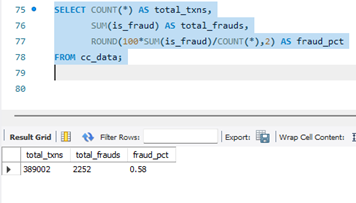
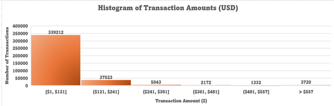
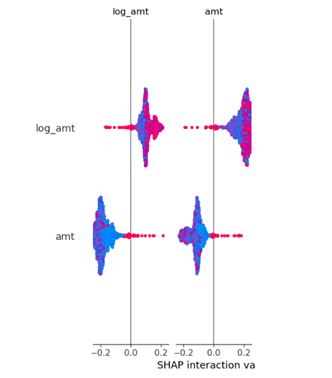
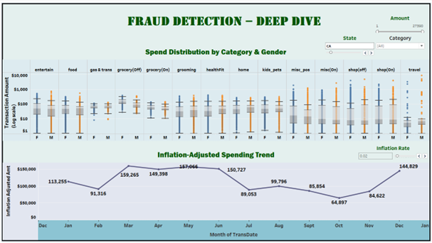
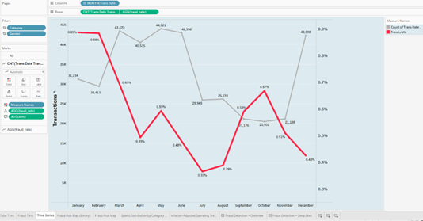
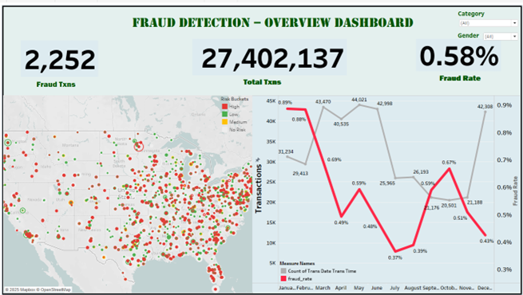

# 🕵️‍♂️ Financial Fraud Detection Capstone Project

This capstone project focuses on **detecting financial fraud in transaction data** using a full analytics workflow — spanning **Excel, SQL, Python, and Tableau**.  
The project demonstrates real-world data validation, fraud pattern detection, feature engineering, and interactive visualization for decision support.

---

## 🎯 Objective

To analyze and visualize credit card transaction data to:
- Identify fraud patterns and behavioral trends  
- Detect anomalies in transaction amount and frequency  
- Compare fraud distribution across demographics and locations  
- Develop an interactive fraud detection dashboard for monitoring  

---

## 🧩 Project Workflow

### 🪣 Step 1 — Excel: Preliminary Data Analysis  
*(Reference: Report Step 1D–1H)*  

Initial data validation and exploratory checks were performed in **Excel** to understand transaction distribution, demographic splits, and regional activity.

<p align="center">
  <br>
  <em>Excel summary of top states by transaction count (TX, PA, NY)</em>
</p>

---

### 🧮 Step 2 — SQL: Transaction Validation & Fraud Summary  
*(Reference: Report Step 2, Pages 12–13)*  

SQL was used to validate transaction counts and compute core fraud metrics such as total transactions, total fraud cases, and fraud percentage.

<p align="center">
  <br>
  <em>MySQL query results showing total transactions, total frauds, and fraud rate (0.58%)</em>
</p>

---

### 🧑‍💻 Step 3 — Python: Exploratory Data Analysis (EDA)  
*(Reference: Report Step 3D–3N)*  

EDA was performed in **Python** using Pandas, Seaborn, and Matplotlib to study transaction distributions, fraud behavior, and correlations between features.

<p align="center">
  <br>
  <em>Distribution of transaction amounts (raw and log-transformed), fraud boxplot, and scatter with city population</em>
</p>

**Key Observations:**  
- Transaction amounts are right-skewed, with a few extreme high-value transactions.  
- Fraud transactions generally cluster around higher transaction amounts.  
- Correlation analysis shows a mild relationship between population and transaction value.  

---

### ⚙️ Step 4 — Feature Engineering & Model Insights  
*(Reference: Report Step 3N, Page 22)*  

Feature importance and behavioral analysis were conducted using model interpretation techniques.  
Key drivers of fraud probability were visualized through SHAP and category-based aggregations.

<p align="center">
  <br>
  <em>Feature interaction (log_amt vs amt) and Top 10 Jobs by Average Transaction Amount</em>
</p>

**Insights:**  
- Transaction amount (`amt`) and its log transformation (`log_amt`) were top predictors.  
- High-value professions show significantly higher spend outliers.  

---

### 📊 Step 5 — Tableau Visualization & Dashboards  
*(Reference: Report Step 4C–4E)*  

Developed interactive Tableau dashboards to monitor fraud KPIs and visualize geographic and temporal patterns.  
Two key dashboards were created — **Fraud KPI Overview** and **Fraud Deep Dive**.

<p align="center">
  <br>
  <br>
  <br>
  <em>Fraud detection dashboards in Tableau showing trends, KPIs, and geographic insights</em>
</p>

**Highlights:**  
- Fraud rate: **0.58% across ~390,000 transactions**  
- Interactive map showing fraud hotspots across U.S. states  
- KPI summary and monthly fraud rate trends  
- Gender × Category comparison for fraud risk  

---

## 🧠 Tools & Technologies

| Tool | Purpose |
|------|----------|
| **Microsoft Excel** | Initial data exploration, pivot summaries |
| **MySQL Workbench** | Data validation, aggregation, fraud metrics |
| **Python (Pandas, Matplotlib, Seaborn)** | Data preprocessing and EDA |
| **Tableau Desktop** | Fraud KPI and map dashboards |
| **SQL Script** | Fraud summary query automation |

---

## 📂 Repository Structure

```
📁 financial-fraud-detection-capstone/
│
├── README.md
│
├── data/
│ ├── raw/
│ │ ├── DATA_ACCESS_NOTE.txt
│ │ └── README_dataset_info.txt
│ └── processed/
│ └── README_placeholder.txt
│
├── docs/
│ ├── images/
│ │ ├── excel-top-states-summary.png
│ │ ├── sql-fraud-summary.png
│ │ ├── histogram-transactions.png
│ │ ├── feature-importance.png
│ │ ├── tableau-kpi-dashboard.png
│ │ ├── tableau-fraud-trend.png
│ │ ├── tableau-fraud-map.png
│ │ └── top-states-transactions.png
│ │
│ └── report/
│ ├── Financial_Fraud_Detection_Report.pdf
│ └── Simplilearn_Project_Guidelines.pdf
│
├── src/
│ ├── fraud_sql_queries.sql
│ ├── fraud_detection_dashboard.twbx
│ ├── prompts_used.txt
│ └── README_placeholder.txt
│
└── LICENSE
```

---

## 📄 Dataset Information

> The original dataset used in this project exceeds GitHub’s file size limit.  
> A compressed version (`Financial_Fraud_Detection_Datasets.zip`) is provided under `data/raw/`.  
> Full data remains securely stored locally for verification and replication.

---

## 👤 Author  

**Ashish Chamel**  
Simplilearn Capstone Project — 2025  

---

## 🏷️ Repository Details  

**Name:** `financial-fraud-detection-capstone`  
**Description:**  
> Comprehensive end-to-end fraud detection analysis integrating Excel, SQL, Python, and Tableau. Includes EDA, feature engineering, and KPI dashboards for fraud monitoring.  

**Tags:**  
`fraud-detection` `data-analytics` `python` `sql` `tableau` `eda` `simplilearn` `capstone-project`

---

### ✅ End of Project Documentation
*"Turning raw data into fraud intelligence through analytics, validation, and visualization."*
